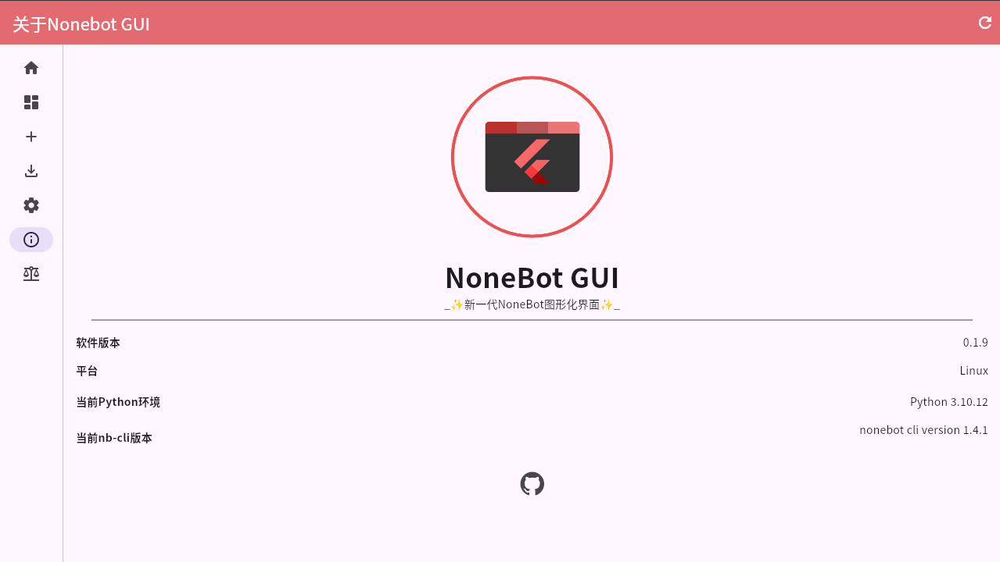

  
   

# nonebot-flutter-gui

_✨ 新一代 NoneBot 图形化界面 ✨_

 
<a href="#使用截图" target="__blank">
  <strong>🌎 使用截图</strong>
</a>
&nbsp;&nbsp;|&nbsp;&nbsp;
<a href="https://github.com/NonebotGUI/nonebot-flutter-gui/releases" target="__blank">
  <strong>📦️ 下载安装包</strong>
</a>

> [!warning] 
> 本项目包含了**大量的史山代码**

## 📖 介绍

新一代 NoneBot 图形化界面，基于 Dart 和 Flutter 开发

## ✨ 特性

- 简约 UI
- 快速上手，开箱即用
- 全平台支持（Windows，Linux，MacOS ~~(待测试)~~）
- 实用高效，一步到位
- 支持多 Bot 管理

## ⚙️安装

即刻前往：[Release](https://github.com/NonebotGUI/nonebot-flutter-gui/releases)

> [!tip]
> 本软件运行需要安装 Microsoft Visual C++ Redistributable 依赖，如无法打开请尝试从此处下载安装运行后使用。
[https://learn.microsoft.com/en-us/cpp/windows/latest-supported-vc-redist](https://learn.microsoft.com/en-us/cpp/windows/latest-supported-vc-redist)

## 🖼️ 使用截图

## 🚚 旧数据迁移指南

从 `0.1.7` 版本开始，NoneBotGUI 将不再使用 `用户目录/.nbgui`作为数据文件夹，而是使用 `path_provider`提供路径 
你需要**手动**将旧版本 `.nbgui` 下的所有目录和文件移动到新版本的文件夹中，在应用程序的 `更多-设置-旧版本数据迁移指南` 中可以看见新版本的路径

## 📑 TODO List

- [ ] 清理史山
- [ ] 使用 GetX 管理状态
- [X] 重构新的 UI
- [X] 在主页面直接启动 Bot
- [X] 检查更新

## 📄 协议

GPL-3.0 license
